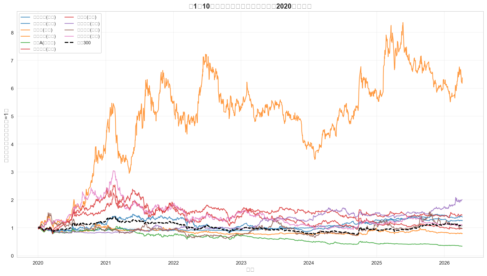
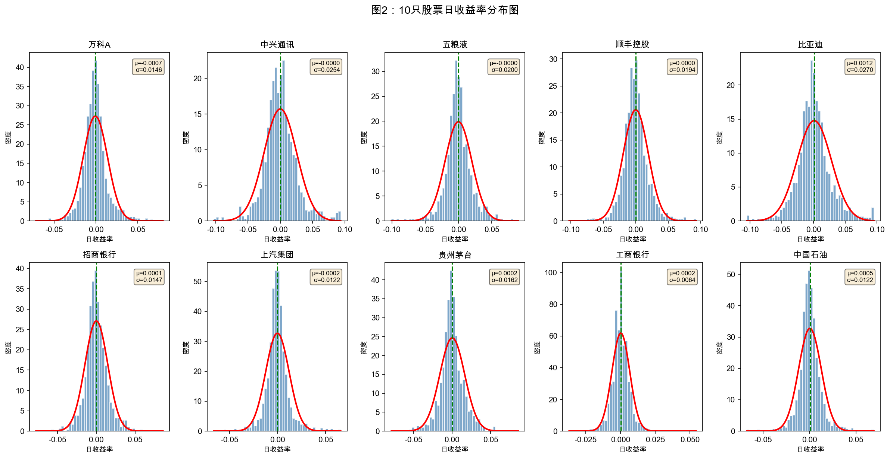
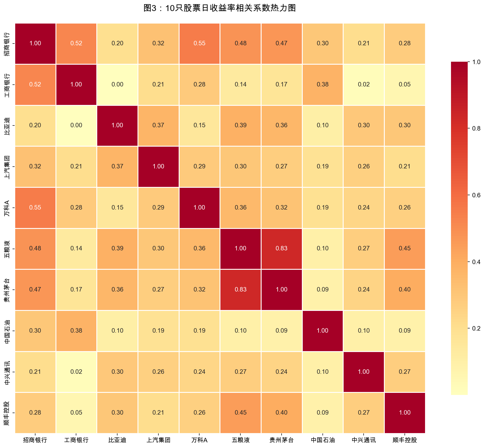
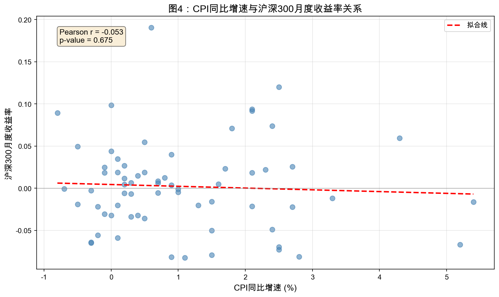

# 描述性统计与可视化 {#sec-analysis}

本章进行日收益率的描述性统计分析和可视化工作。

## 收益率计算

使用对数收益率计算公式：

$$r_t = \ln\left(\frac{P_t}{P_{t-1}}\right)$$

```python
# 计算对数收益率
stock_data['log_return'] = np.log(stock_data['close'] / stock_data['close'].shift(1))
```

## 基本统计量

### 统计量定义

| 统计量 | 公式 | 含义 |
|--------|------|------|
| 年化均值 | $\bar{r} \times 252$ | 年均收益率水平 |
| 年化波动率 | $\sigma \times \sqrt{252}$ | 收益率离散程度 |
| 偏度 | $E[(r-\mu)^3] / \sigma^3$ | 分布不对称性 |
| 峰度 | $E[(r-\mu)^4] / \sigma^4 - 3$ | 分布尖峰程度 |
| 最大回撤 | $\max(P_t - P_{peak}) / P_{peak}$ | 最大亏损幅度 |

### 描述性统计结果

| 股票 | 行业 | 年化均值 | 年化波动率 | 偏度 | 峰度 | 最大回撤 |
|------|------|---------|----------|------|------|---------|
| 万科A | 房地产 | -17.99% | 23.18% | 0.584 | 3.719 | -71.43% |
| 中兴通讯 | 通讯 | -0.37% | 40.27% | 0.307 | 2.524 | -67.91% |
| 五粮液 | 白酒 | -0.53% | 31.79% | 0.001 | 3.342 | -70.14% |
| 顺丰控股 | 物流 | 0.15% | 30.73% | 0.341 | 3.558 | -74.23% |
| 比亚迪 | 汽车 | 30.31% | 42.88% | 0.305 | 2.099 | -55.73% |
| 招商银行 | 银行 | 3.73% | 23.35% | 0.258 | 3.492 | -48.42% |
| 上汽集团 | 汽车 | -3.95% | 19.34% | 0.407 | 5.786 | -40.60% |
| 贵州茅台 | 白酒 | 6.24% | 25.69% | 0.200 | 3.512 | -51.12% |
| 工商银行 | 银行 | 5.54% | 10.23% | 0.495 | 6.581 | -14.39% |
| 中国石油 | 能源 | 11.61% | 19.32% | 0.275 | 5.579 | -22.99% |

### 统计量解读

**年化均值**：

- 比亚迪表现最佳（30.31%），受益于新能源汽车行业高速发展
- 万科A表现最差（-17.99%），受房地产行业下行影响
- 工商银行波动最小，收益稳健

**年化波动率**：

- 比亚迪波动率最高（42.88%），成长股特征明显
- 工商银行波动率最低（10.23%），防御性较强
- 银行股整体波动率较低

**最大回撤**：

- 顺丰控股回撤最大（-74.23%），行业竞争加剧
- 工商银行回撤最小（-14.39%），抗风险能力强

## 可视化分析

### 图1：归一化收盘价走势图



**图1解读**：

1. **整体趋势**：
   - 2020-2021年：A股市场整体上涨，白酒、新能源板块表现突出
   - 2022年：市场回调，房地产、银行板块承压
   - 2023-2024年：结构性行情，AI、新能源轮动

2. **行业表现差异**：
   - 白酒行业（茅台、五粮液）：长期表现稳健，但2022年后有所回调
   - 汽车行业（比亚迪）：新能源概念驱动，波动较大但涨幅可观
   - 银行行业（招行、工行）：相对稳健，波动较小
   - 房地产行业（万科）：受政策影响，表现较弱

3. **与沪深300对比**：部分股票跑赢沪深300，部分跑输

### 图2：日收益率分布图



**图2解读**：

1. **分布形态**：大部分股票收益率分布接近正态，但呈现尖峰厚尾特征

2. **收益率集中度**：
   - 大部分日收益率集中在±3%范围内
   - 银行股收益率分布更集中，波动较小
   - 汽车股、成长股收益率分布更分散

3. **与正态分布的差异**：
   - 红色正态曲线与实际分布存在差异
   - 实际分布尾部更厚，说明极端事件概率更高

### 图3：收益率相关系数热力图



**图3解读**：

1. **同行业相关性**：
   - 银行股（招行、工行）：相关系数较高，同行业联动明显
   - 白酒股（茅台、五粮液）：相关系数较高，消费板块联动

2. **跨行业相关性**：
   - 不同行业间相关性相对较低
   - 银行与白酒、银行与汽车的相关性中等
   - 能源与消费类股票相关性较低

3. **投资组合启示**：
   - 跨行业配置可以有效分散风险
   - 同行业股票不宜过度集中配置

### 图4：CPI与股市关系



**图4解读**：

1. **相关系数分析**：CPI与沪深300月度收益率存在一定相关性

2. **经济含义解读**：
   - CPI反映通货膨胀水平，影响央行货币政策
   - 高通胀可能导致紧缩政策，对股市形成压力
   - 低通胀环境通常更有利于股市表现

3. **局限性**：相关性不等于因果关系，股市受多种因素影响

## 小结

本章完成了以下分析工作：

1. 计算了10只股票的描述性统计量
2. 绘制了归一化价格走势图
3. 分析了收益率分布特征
4. 计算了股票间相关系数
5. 探讨了宏观指标与股市的关系

下一章将进行CAPM模型回归分析。
