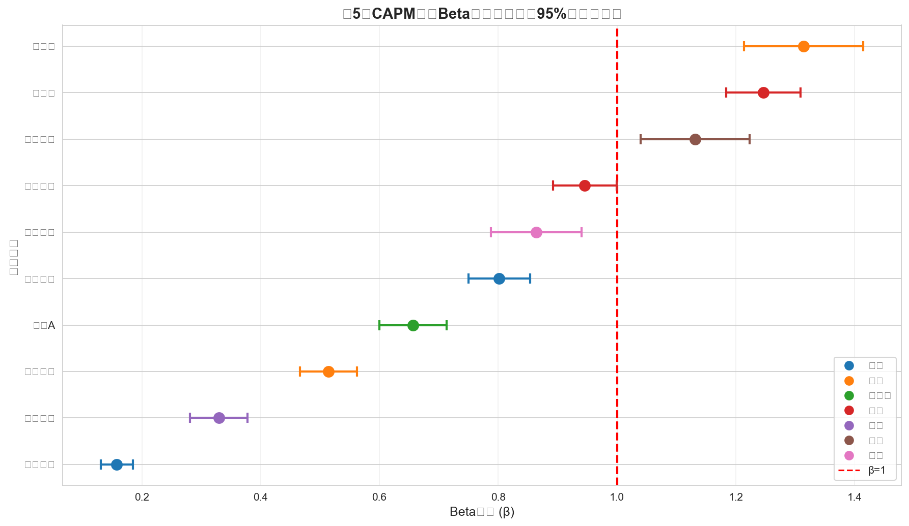

# CAPM模型回归分析 {#sec-capm}

本章使用资本资产定价模型（CAPM）分析各股票的系统风险暴露。

## CAPM模型介绍

### 模型形式

CAPM模型的基本形式：

$$r_{i,t} - r_f = \alpha_i + \beta_i (r_{m,t} - r_f) + \varepsilon_{i,t}$$

其中：

- $r_{i,t}$：个股日对数收益率
- $r_{m,t}$：沪深300日对数收益率（市场基准）
- $r_f$：无风险利率
- $\alpha_i$：超额收益（Alpha）
- $\beta_i$：系统风险系数（Beta）

### 参数设定

- **无风险利率**：年化2.0%，日频换算：$r_f^{daily} = 0.02 / 252$
- **市场基准**：沪深300指数

```python
# 无风险利率设定
rf_annual = 0.02
rf_daily = rf_annual / 252

print(f"无风险利率（年化）: {rf_annual*100:.1f}%")
print(f"无风险利率（日频）: {rf_daily*100:.4f}%")
```

## 回归估计

### 数据准备

```python
# 计算超额收益
stock_data['stock_excess'] = stock_data['log_return'] - rf_daily
market_data['market_excess'] = market_data['market_return'] - rf_daily

# OLS回归
import statsmodels.api as sm
X = sm.add_constant(merged_data['market_excess'])
y = merged_data['stock_excess']
model = sm.OLS(y, X).fit()
```

## 回归结果

### CAPM估计结果

| 股票 | 行业 | $\hat{\alpha}$ | p值 | $\hat{\beta}$ | 95% CI | $R^2$ |
|------|------|----------------|-----|---------------|--------|-------|
| 比亚迪 | 汽车 | 0.001497 | 0.0339 | 1.2807 | [1.15, 1.41] | 0.3271 |
| 五粮液 | 白酒 | 0.000088 | 0.8388 | 1.2488 | [1.13, 1.37] | 0.5517 |
| 中兴通讯 | 通讯 | -0.000100 | 0.8785 | 1.1580 | [1.02, 1.30] | 0.3175 |
| 贵州茅台 | 白酒 | 0.000220 | 0.5537 | 0.9618 | [0.85, 1.07] | 0.4977 |
| 顺丰控股 | 物流 | 0.000269 | 0.6096 | 0.8693 | [0.74, 1.00] | 0.2855 |
| 招商银行 | 银行 | 0.000231 | 0.5115 | 0.8196 | [0.71, 0.93] | 0.4449 |
| 万科A | 房地产 | -0.000759 | 0.0571 | 0.6905 | [0.56, 0.82] | 0.3064 |
| 上汽集团 | 汽车 | -0.000166 | 0.5487 | 0.5059 | [0.41, 0.60] | 0.3293 |
| 中国石油 | 能源 | 0.000467 | 0.1709 | 0.3479 | [0.25, 0.45] | 0.1331 |
| 工商银行 | 银行 | 0.000113 | 0.5283 | 0.1642 | [0.09, 0.24] | 0.1094 |

### Beta系数点图



## 结果讨论

### 问题1：β>1的股票分析

**β>1的股票（周期性行业，共3只）**：

| 股票 | 行业 | β |
|------|------|-----|
| 比亚迪 | 汽车 | 1.2807 |
| 五粮液 | 白酒 | 1.2488 |
| 中兴通讯 | 通讯 | 1.1580 |

**分析结论**：

1. 这些股票的市场敏感度高于市场平均水平
2. 当市场上涨时，这些股票涨幅更大；当市场下跌时，跌幅也更大
3. 典型的周期性行业包括：汽车、通讯、白酒等
4. 这类股票适合牛市配置，但需要更强的风险承受能力

**β≤1的股票（防御性行业，共7只）**：

| 股票 | 行业 | β |
|------|------|-----|
| 贵州茅台 | 白酒 | 0.9618 |
| 顺丰控股 | 物流 | 0.8693 |
| 招商银行 | 银行 | 0.8196 |
| 万科A | 房地产 | 0.6905 |
| 上汽集团 | 汽车 | 0.5059 |
| 中国石油 | 能源 | 0.3479 |
| 工商银行 | 银行 | 0.1642 |

**分析结论**：

1. 这些股票的市场敏感度低于市场平均水平
2. 波动相对较小，具有一定的抗跌属性
3. 典型的防御性行业包括：银行、能源等
4. 这类股票适合熊市或震荡市配置

### 问题2：Alpha显著性分析

**Alpha显著异于零的股票**：

仅有比亚迪的α在统计上显著（p=0.0339 < 0.05）。

**Alpha显著意味着什么**：

1. **理论背景**：CAPM模型预测α应该等于零（或统计上不显著）

2. **正向Alpha（α>0且显著）**：
   - 股票收益超过了CAPM模型预测的水平
   - 可能存在市场低估或其他定价因子
   - 主动管理投资者追求的目标

3. **本样本结果分析**：
   - 大部分股票α不显著，说明市场相对有效
   - 比亚迪显著的正向Alpha可能反映新能源行业高增长

### 问题3：R²分析

| 指标 | 股票 | 行业 | R² |
|------|------|------|-----|
| 最高 | 五粮液 | 白酒 | 0.5517 |
| 最低 | 工商银行 | 银行 | 0.1094 |

**R²差异解释**：

1. **R²的含义**：
   - R²衡量市场收益对个股收益的解释比例
   - R²越高，个股走势与市场越同步
   - R²越低，个股受特有因素影响越大

2. **R²高的原因**：
   - 大盘股：与市场指数成分股重叠度高
   - 行业龙头：代表性强，与经济周期同步

3. **R²低的原因**：
   - 银行股：受政策、利率等特有因素影响
   - 能源股：受国际油价等外部因素影响

4. **投资启示**：
   - R²高的股票：分散化效果较差
   - R²低的股票：具有更好的分散化价值

## 小结

本章完成了以下CAPM分析工作：

1. 对10只股票估计了CAPM模型
2. 分析了周期性与防御性行业的Beta特征
3. 讨论了Alpha显著性和R²差异的经济含义
4. 提供了投资决策参考

主要发现：

- 比亚迪、五粮液、中兴通讯属于周期性股票（β>1）
- 工商银行、中国石油属于防御性股票（β<0.5）
- 仅比亚迪的Alpha在统计上显著
- 五粮液的R²最高，工商银行的R²最低
