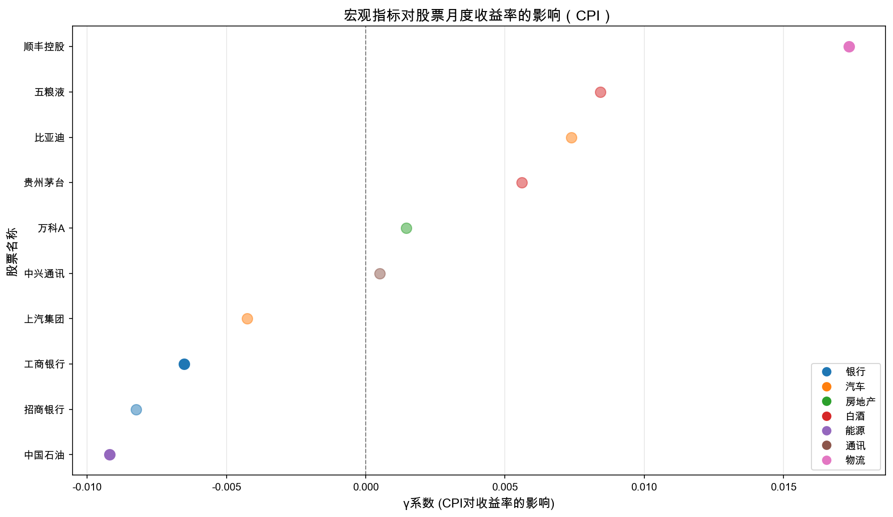

# 宏观指标对股票收益率的影响 {#sec-macro}

本章分析宏观经济指标（CPI）对股票月度收益率的影响，探讨不同行业的敏感性差异。

## 模型设定

建立宏观指标对股票收益率的影响模型：

$$r_{i,t}^{\text{月}} = \alpha_i + \gamma_i \cdot X_t + \varepsilon_{i,t}$$

其中：

- $r_{i,t}^{\text{月}}$：股票月度对数收益率
- $X_t$：CPI同比增速
- $\gamma_i$：宏观敏感系数

## 回归结果

### CPI对股票收益率的影响

| 股票 | 行业 | $\hat{\gamma}$ | p值 | $R^2$ | 显著 |
|------|------|----------------|-----|-------|------|
| 万科A | 房地产 | 0.0014 | 0.820 | 0.001 | No |
| 中兴通讯 | 通讯 | 0.0005 | 0.962 | 0.000 | No |
| 五粮液 | 白酒 | 0.0084 | 0.362 | 0.013 | No |
| 顺丰控股 | 物流 | 0.0173 | 0.061 | 0.054 | Yes* |
| 比亚迪 | 汽车 | 0.0074 | 0.526 | 0.006 | No |
| 招商银行 | 银行 | -0.0082 | 0.192 | 0.026 | No |
| 上汽集团 | 汽车 | -0.0043 | 0.345 | 0.014 | No |
| 贵州茅台 | 白酒 | 0.0056 | 0.456 | 0.009 | No |
| 工商银行 | 银行 | -0.0065 | 0.001 | 0.152 | Yes*** |
| 中国石油 | 能源 | -0.0092 | 0.060 | 0.054 | Yes* |

注：\* p<0.1, \*\*\* p<0.01

### 敏感性可视化

## 结果讨论

### 1. 敏感性差异分析

**显著受CPI影响的股票**：

- **工商银行（银行）**：γ = -0.0065，p < 0.01，高度显著
  - 银行业对利率政策高度敏感
  - CPI上升预期导致货币政策收紧，影响银行盈利

- **中国石油（能源）**：γ = -0.0092，p < 0.1
  - 能源行业与宏观经济周期高度相关
  - CPI波动反映经济景气程度

- **顺丰控股（物流）**：γ = 0.0173，p < 0.1
  - 物流业与消费景气度相关
  - CPI反映消费活跃程度

**不显著的股票**：

- 白酒行业（茅台、五粮液）：消费刚性，对宏观敏感度低
- 房地产行业（万科）：受政策影响更大，CPI敏感度不显著
- 汽车行业：影响渠道复杂，单一宏观指标解释力有限

### 2. 经济逻辑分析

**正向影响（γ > 0）**：

- CPI上升反映经济活跃
- 消费相关行业受益于通胀环境
- 物流、通讯等行业与经济景气正相关

**负向影响（γ < 0）**：

- CPI上升引发货币政策收紧预期
- 银行、能源等周期性行业承压
- 资金成本上升影响盈利

### 3. 投资启示

1. **宏观环境配置策略**：
   - 高通胀环境：增加防御性股票配置（白酒、消费）
   - 低通胀环境：可增加周期性股票配置（银行、能源）

2. **行业轮动建议**：
   - 关注CPI趋势变化
   - 提前调整行业配置权重

3. **风险提示**：
   - 单一宏观指标解释力有限
   - 需结合多因素综合分析
   - 历史关系不代表未来表现

## 小结

本章完成了宏观指标对股票收益率的影响分析：

1. 估计了CPI对10只股票月度收益率的影响
2. 发现工商银行、中国石油、顺丰控股受CPI影响显著
3. 不同行业对宏观指标的敏感性存在差异
4. 提供了基于宏观环境的投资配置建议

主要发现：

- 银行和能源行业对CPI负向敏感
- 物流行业对CPI正向敏感
- 白酒行业对宏观敏感度最低
